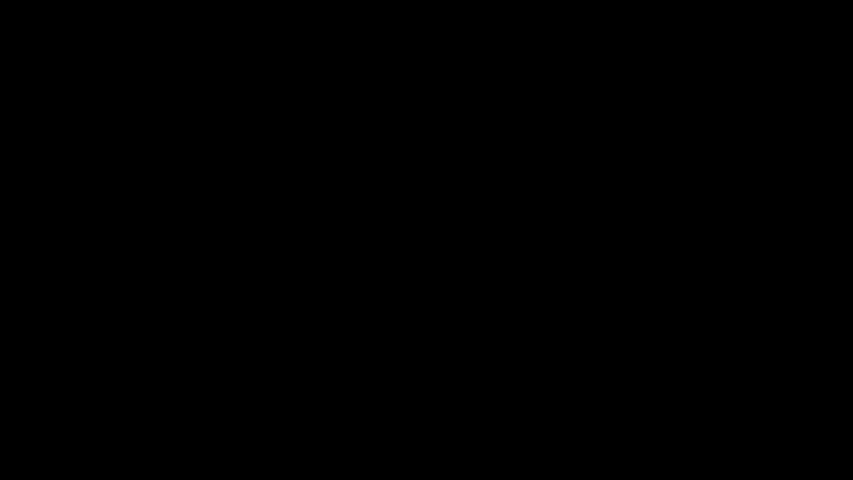

# Demo - A better modelling language for optimization problem

## Introduction

This is an attempt at writing a better modelling language for optimization problem. This language is not even a prototype. Thus, I'd like to call it just a demonstration. Due to lack of creativity, the modelling langauge will be named `demo`, short for demonstration.

Demo is not trying to be flexible or comprehensive. As a result some job scheduling problem may not be expressed in demo. The primary goal is to reduce the boilerplate required to write programs using the `python-mip` package. On top of reducing ceremony, the language tries to move away from python list comprehension and introduces syntax which is similar to mathematical notation. For example, we would write summation in mathematical notation as

$$
\sum_{i = 0}^{n} x_i
$$

we can write such an expression in python as

```python
sum(x[i] for i in range(n + 1))
```

in demo it is closer to the mathematical notation.

```python
sum (i:=0:n) x[i]
```



Unlike python, the iteration precedes the expression being summed so it gets familiar to read. This reversal is useful when there are nested for loops where in python the order of iteration gets inverted to read.

## Writing a program in Jupyter Notebook

The easiest way is to write the programs in a jupyter notebook. Let's take the example of [knapsack problem](https://python-mip.readthedocs.io/en/latest/examples.html#the-0-1-knapsack-problem) for the sake of demonstration the languages. The program we'd write in plain python would be

```python
from mip import Model, xsum, maximize, BINARY

p = [10, 13, 18, 31, 7, 15]
w = [11, 15, 20, 35, 10, 33]
c, I = 47, range(len(w))

m = Model("knapsack")
x = [m.add_var(var_type=BINARY) for i in I]
m.objective = maximize(xsum(p[i] * x[i] for i in I))
m += xsum(w[i] * x[i] for i in I) <= c
m.optimize()

selected = [i for i in I if x[i].x >= 0.99]
print("selected items: {}".format(selected))
```

To define an mixed integer programing problem, we need to define an objective function and several constraints. All the `+=` statements in this program are the constraints being added and the `m.objective` assignment is the objective function.

We'll see now how to write the same program in demo inside of a jupyter notebook. First we should enable the demo lang extension by running the cells.

```python
import demo_lang
```

```python
%load_ext demo_lang
```

Once the magic line is run we can write our demo programs in a separate cell. We would run our program in three cells

```python
p = [10, 13, 18, 31, 7, 15]
w = [11, 15, 20, 35, 10, 33]
c = 47
n = len(w)
```

```python
%%demo Knapsack Problem

var bin x = ndarray (n)
obj max sum (i:=n) p[i] * x[i]
constr (sum (i:=n) w[i] * x[i]) <= c
```

```python
selected = [i for i in range(n) if x[i].x >= 0.99]
print("selected items: {}".format(selected))
```

The first and the third cell is plain python code. We write our demo program in the second cell. The cell starts with the magic cell line

```
%%demo Knapsack Problem
```

This tells the notebook that the cell will conatin the demo program. The `%%demo` is the magic cell line which declares the rest of the cell as a demo program. The rest of the line will result in the name of the model, so "Knapsack Problem" becomes the name of the model. When the cell will run, the generated python-mip model (`mip.model.Model`) will be the output. The demo program can access all the python variables in the notebook's scope. When the cell runs, the model will be optimized and the declared variables in the demo program will be accessible in the scope of the notebook thus the variable will can be used in the subsequent cells. Thus in the subsequent cells we can access the model using the `_` variable. It will we wise to rename this to `model` for further use.

```python
model = _
print(model.objective_value)
```

Let's explain the demo program one line at a time. This first line

```python
var bin x = ndarray (n)
```

Declares a variable `x` as and n-dimensional array of shape `(n)`. Here the variable `n` is in scope because we ran the previous cell which declared it as 

```python
n = len(w)  # 6
```

The `var` keyword start an assignment statement. The keyword is followed by the type of variable to be declared. There are three types: `cont`, `int`, `bin`. These types map exactly to the corresponding types in python-mip.

```
cont -> mip.CONTINUOUS
bin  -> mip.BINARY
int  -> mip.INTEGER
```

The function `ndarray` takes in a list of integers as arguments which will describe the shape of the array and the variable `x` will be a nested python list with each element being a `mip.entities.Var`. You can't declare a single variable. You'd always have to use `ndarray` to declare variables. To declare a singular variable, make an `ndarry` with shape `(1)` and always refer to the varible as `x[0]`.

```python
var int x = ndarray (1)
obj min x[0]
```

The next line declares the objective of the optimization problem.

```python
obj max sum (i:=n) p[i] * x[i]
```

It start with the keyword `obj` followed by `min` or `max` which declares if the expression should be minimized or maximized. The rest of the statement is the expression which is the objective. It is the summation of the expression `p[i] * x[i]` over the range 0, 1, 2, ... n.

The last line adds a constraint to the problem which starts with the keyword `constr` and is followed by the expression

```
(sum (i:=n) w[i] * x[i]) <= c
```

Which simply says, the sum of `w[i] * x[i]` over the range 0, 1, 2, ... n should be less than equal to `c`. This is enough to describe the problem.

Once we run the cell the python-mip model is generated and it is optimized, thus we get our answer in the `x` variable which is shown in the last cell.

## Writing a program in a python file

The demo program must be written as a python string and then it can be compiled. The class `demo_lang.compile.ModelGenerator` will be used here. This will instantiate an `ModelGenerator` object. The constructor accepts three arguemnts. First is the name of the model, second is the string containing the source of the demo program and thrid are the python variables that must be present in the demo program's scope. It will generate a [`mip.model.Model`](https://docs.python-mip.com/en/latest/classes.html#model) when the method `generate` is called. The `generate` method is NOT going to return a model. The model will be present in the attribute [`ModelGenerator.model`](https://docs.python-mip.com/en/latest/classes.html#model). Instead it returns the scope of the program. This will contain all the variables declares in program in the same way as you get locally scoped variable when the function [`locals`](https://docs.python.org/3/library/functions.html#locals) is called. To access the variables we would subscript the `scope` variable like this `scope['x']`. Once we generate the model we must optimize it by calling the method `optimize` on it. A complete program would look like this.

```python
from demo_lang.compile import ModelGenerator

p = [10, 13, 18, 31, 7, 15]
w = [11, 15, 20, 35, 10, 33]
c = 47
n = len(w)
source = """
var bin x = ndarray (n)
obj max sum (i:=n) p[i] * x[i]
constr (sum (i:=n) w[i] * x[i]) <= c
"""
gen = ModelGenerator(
    "knapsack",
    source,
    {
        "p": p,
        "w": w,
        "c": c,
        "n": n,
    }
)
scope = gen.generate()
gen.model.optimize()
selected = [i for i in range(n) if scope['x'][i].x >= 0.99]
print("selected items: {}".format(selected))
```